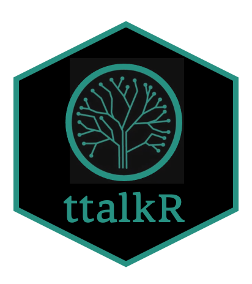

ttalkR 
======================================================================================================
 


An unified processing workflow for standardizing treetalkers data from the italian treetalkers network. Conversion of digital numbers to physical units is done according to the TT+ User Manual("TT+manual (3.2)_SA_020920""). 'ttalkR' provides tools for downloading, cleaning, quality check and diagnostic plotting. The architecture and the procedures are described in Tomelleri E. (202x, https://doi.org/...).

'ttalkR' has been developed in the context of the project ItTREEnet: "The Italian TREETALKER NETWORK: continuous large scale monitoring of tree functional traits and vulnerabilities to climate change".The project is finaced by the italian minitery for instruction, university and research - Progetti di ricerca di Rilevante Interesse Nazionale (PRIN 2017).

To install the ttalkR package
```{r, eval = F}
install.packages("devtools")
devtools::install_github("EnricoTomelleri/ttalkR")
help(package=ttalkR)
citation("ttalkR")

Enrico Tomelleri (202x)
ttalkR: unified pre-processing of TreeTalker data 
R package version 0.1

A BibTeX entry for LaTeX users is

  @Manual{,
    title = {{ttalkR}: unified pre-processing of TreeTalker data },
    author = {Enrico Tomelleri},
    organization = {Free University of Bozen/Bolzano},
    address = {Bolzano, Italy},
    year = {202x},
    note = {R package version 0.1},
    url = {https://github.com/EnricoTomelleri/ttalkR},
  }

```
